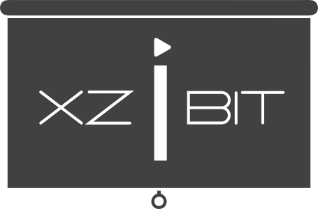

[ ](https://codeship.com/projects/96247)
[](https://travis-ci.org/mabrasil/xzibit)
[](https://codeclimate.com/github/mabrasil/xzibit)
[](https://david-dm.org/mabrasil/xzibit)
[](https://david-dm.org/mabrasil/xzibit#info=devDependencies)

# Create presentations using cool kids' technologies.



> Easily create modern presentations using Reveal.JS, Gulp, Jade, Stylus and more.

##Table of Contents

- [What's inside?](#whats-inside)
- [Using](#using)
  - [Getting Started](#getting-started)
  - [Next Steps](#next-steps)
    - [Setup the project's basic info](setup-the-projects-basic-info)
    - [Write your slides](#write-your-slides)
    - [Understand the Folders and Files structure](#understand-the-folders-and-files-structure)
    - [Understand the Gulp Tasks](#understand-the-gulp-tasks)
- [Contributing](#contributing)
- [License](#license)
- [Credits](#credits)

## What's inside?

This boilerplate includes:

### Reveal.js

[Reveal](https://github.com/hakimel/reveal.js/) is an amazing framework for easily creating beautiful presentations using HTML. This boilerplate also comes with the following plugins for Reveal:

|    Command      |                 Description                  |
|-----------------|----------------------------------------------|
| *Highlight.js*  | Syntax highlighting                          |
| *Speaker Notes* | Per-slide notes in a separate browser window |
| *Chartist.js*   | Responsive charting library                  |
| *Math.js*       | Rendering of math equations inside           |
| *Print-PDF*     | Allows presentations to be exported to PDF   |
| *vivus.js*      | Allows you to animate SVGs                   |
| *zoom.js*       | Zoom in and out with `Alt+click`             |

### Jade

The  [Jade Engine](http://jade-lang.com/)  is one of the most powerful templating engines we have nowadays and its use is intended to make the app templates' code more beautiful and *easier to maintain*. It also aims to solve some problems such as missing or mal-matched closing tags.

### Stylus

[Stylus](https://learnboost.github.io/stylus/) has everything that modern *CSS preprocessors* should have: *variables*,
*mixins*, *nesting*, *extending* and many other cool things. And it's writen in Javascript and runs in *NodeJS*.

### Gulp

*Stream-based build system*, *code over configuration*, *idiomatic Node modules*, a *simple and elegant API*...
There are many reasons why [Gulp](http://gulpjs.com/) can be a good bet on task runners.

Here we have many cool plugins like `Browser Sync` - which allows you to sync all your devices and even make
livereloading -, `Jade`, `Stylus`, `Imagemin` and many other good ones.

In this project, we also prevent your `gulpfile.js` from growing too large by splitting it into multiple files,
with one task per file. You can check out the [tasks directory](gulp/tasks) to see how it works.

## Using

### Getting Started

1. Make sure you have the main dependencies to run this boilerplate:

  - [NodeJS](http://nodejs.org/)
  - [Bower](http://bower.io/)
  - [GulpJS](http://gulpjs.com/)

2. Clone this repository:

  ```sh
  $ git clone https://github.com/mabrasil/xzibit.git my_talk
  ```

3. Install **all required dependencies**:

  ```sh
  $ cd my_talk
  $ npm install
  $ bower install
  ```

4. Run the default gulp task:

  ```sh
  $ gulp
  ```

### Next Steps

#### Setup the project's basic info

Some of basic metadata from your slides will be rendered from a [`config.json`](/src/config.json) file. This is done to make it easier
to change some general data - like the presentation *name* or *descrption*. The `config.json` initial structure is:

```json
{
  "about": {
    "title": "My Awesome Presentation",
    "description": "My Awesome Presentation @ an Awesome Event",
    "author": "An Awesome Speaker",
    "site": {
        "url": "https://github.com/mabrasil/xzibit",
        "googleAnalytics": "",
        "cover": "images/meta/screenshot.png",
        "favicon": "images/meta/favicon.png"
    }
  },
  "deploy":{
    "rsync":{
      "username":"",
      "hostname": "",
      "dest": ""
    },
    "github":{
      "remoteUrl": "",
      "branch": "",
      "message": "Deployed to Github Pages at [timestamp]"
    }
  }
}
```

These are the data given by `config.json`:

##### About

- `title`:

  **Type**: `string`

  **Equivalent**: `<title></title>`

- `description`:

  **Type**: `string

  **Equivalent**: `<meta name="description" content="">`

- `author`:

  **Type**: `string`

  **Equivalent**: `<meta name="author" content="">`

###### Site

- `url`:

  **Type**: `string`

  **Description**: The *URL* of your presentation.

- `googleAnalytics`:

  **Type**: `string`

  **Description**: Your *Google Analytics ID*.

- `cover`:

  **Type**: `string`

  **Equivalent**:

    - `<meta property="og:image" content="">`
    - `<meta property="twitter:image:src" content="">`
    - `<meta itemprop="image" content="">`

- `favicon`:

  **Type**: `string`

  **Description**: The *favicon* of your slides.

##### Deploy

###### Rsync

- `username`:

  **Type**: `string`

  **Description**: Your username at the remote server.

- `hostname`:

  **Type**: `string`

  **Description**: Your server domain (URL).

- `dest`:

  **Type**: `string`

  **Description**: Path on the server that will receive the files.

###### Github Pages

- `remoteUrl`:

  **Type**: `string`

  **Description**: URL for the remote of your repo.

- `branch`:

  **Type**: `string`

  **Description**: The branch where deploy will by done.

- `message`:

  **Type**: `string`

  **Description**: The desired commit message.

> You can also add to your `config.json` all the options supported by [gulp-gh-pages](https://www.npmjs.com/package/gulp-gh-pages).

#### Write your slides

- Each new **slide** (horizontally navigated) is a new `.jade` file in which we work on - and after add in `src/templates/index.jade` making the includes in the order of presentation.

  > Your `index.jade` must be something like this:

    ```jade
    doctype html
    html
      include layouts/head
      body
        .reveal
          .slides

            include ../slides/slide-1
            include ../slides/slide-2
            // And so on

        include layouts/scripts
    ```

- Each new **vertical slide** (vertically navigated, inside a **slide**) is a `section.sec-slide` within the `section` in the slide that you're working in.

  > Inside a slide, you can add a **vertical slide** by doing this:

    ```jade
    section

      // Slide 1
      section.sec-slide

        h1.white.upper Slide 1 Content

      // Slide 2
      section.sec-slide

        h1.white.upper Slide 2 Content
    ```

- Each new **fragment** (that makes elements appear as you navigate inside the slide - giving more interactivity) you have to add `.fragment` in the element.

  > Ex.: If you want a list, but you don't want it to be displayed at once, but as you navigate in the slide, then you do:

    ```jade
    ul
        li.fragment Item 1
        li.fragment Item 2
        li.fragment Item 3
    ```

#### Understand the Folders and Files structure

If everything from the [Getting Started](#getting-started) section goes well, you should have this:

```
|-- gulp/
|-- src/
|   |-- images/
|   |-- scripts/
|   |-- slides/
|   |-- styles/
|   |-- templates/
|   |-- videos/
|   |-- config.json
|-- out/
|   |-- styles/
|       |-- main.css
|   |-- images/
|   |-- scripts/
|       |-- main.js
|   |-- index.html
|-- .editorconfig
|-- .stylintrc
|-- gulpfile.js
|-- package.json
```

Now let's find out what each one of those files and folders mean.

P.S.: Some very commom files - or less important - are shown here, such as the `.md` ones - *README*, *LICENSE* *CONTRIBUTING* -, the CIs tracking files like `.codeclimate.yml` or `.travis.yml` and others.

##### [`gulp/`](/gulp/)

Contains the module with all the *gulp tasks*.

##### [`src/images/`](/src/images/)

Contains the *images* that will be used in your presentation.

##### [`src/scripts/`](/src/scripts/)

Contains the *scripts* that will be used in your presentation.

##### [`src/slides/`](/src/slides/)

Contains each *slide* - written in *Jade* - of your presentation.

##### [`src/styles/`](/src/styles/)

Contains the *styles* - written in *Stylus* - that will be used in your presentation.

##### [`src/templates/`](/src/templates/)

Contains the *tamplates* - written in *Jade* - that will be used in your presentation.

##### [`src/config.json`](/src/config.json)

Contains some of basic info from your presentation that will be rendered in the templates.

##### out/

This is where the generated files are stored, once the tasks are finished. However, this directory is unnecessary in versioning, so it's [ignored](.gitignore).

##### [`gulpfile.js`](gulpfile.js)

Calls the gulp tasks.

##### [`package.json`](package.json)

Contains many metadata relevant to the project.

#### Understand the Gulp Tasks

All the Gulp tasks are in the [`tasks/`](gulp/tasks) folder. Each one consists of a module with a function which is required into tasks defined in the [`gulpfile`](https://github.com/mabrasil/xzibit/blob/master/gulpfile.js).

|     Command         |                Description                |
|---------------------|-------------------------------------------|
| `gulp`              | Initialize watch for changes and a server |
| `gulp jade`         | Compile Jade files                        |
| `gulp stylus`       | Compile Stylus files                      |
| `gulp img-clean`    | Clean the images folder                   |
| `gulp img-minify`   | Compress image files                      |
| `gulp watch`        | Call to watch files                       |
| `gulp deploy-rsync` | Deploy via rsync                          |
| `gulp deploy-gh   ` | Deploy to Github Pages                    |
| `gulp build`        | Minify files and deploy via both          |

If everything happens okay, you must see something like this:


## Contributing

### Versioning

It is intended to maintain this project under the [Semantic Versioning] (http://semver.org/) guidelines. Releases will
be numbered with the following format:

`<major>.<minor>.<patch>`

### Reporting a bug

1. Look for any related issues [here](https://github.com/mabrasil/xzibit/issues).
2. If you find an issue that seems related, please comment there instead of creating a new issue. If it is determined to be a unique bug, we will let you know that a new issue can be created.
3. If you find no related issue, create a new issue by clicking [here](https://github.com/mabrasil/xzibit/issues/new).
If we find an issue that's related, we will reference it and close your issue, showing you where to follow the bug.
4. Tell us important details like what operating system you are using.
5. Include any errors that may be displayed (see [Chrome Console instructions](https://developer.chrome.com/devtools/docs/console#opening_the_console) for how to do that).
6. Update us if you have any new info, or if the problem resolves itself!

### The 5 magic steps

1. Fork it!
2. Create your feature branch: `git checkout -b my-new-feature`
3. Commit your changes: `git commit -m 'Add some feature'`
4. Push to the branch: `git push origin my-new-feature`
5. Submit a pull request :)

##License

[xzibit](https://github.com/mabrasil/xzibit) is distributed under the
MIT License, available in this repository. All contributions are assumed to be also licensed under
the MIT License.

## Credits

- Part of this project's original structure - some tasks and directories organization - was taken
from [Willian Justen](https://github.com/willianjusten)'s [reveal-boilerplate](https://github.com/willianjusten/reveal-boilerplate) -
maybe now the two projects look very different.
